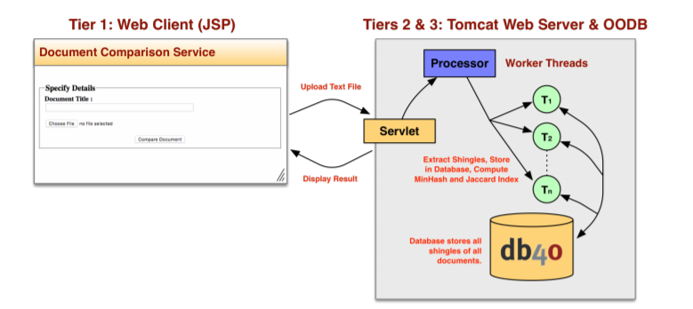

# A JEE Application for Measuring Document Similarity
> BSc (hons) in Software Development, Year 4  
> Module: Advanced Object Oriented Software Development  
> Lecturer: Dr John Healy  

## [Contents](#contents)   
* [Introduction](#intro)
* [Project Overview](#overview)  
* [Technologies](#tech)
* [UML](#uml)  
* [How To Run](#run)
* [References](#ref)
 
# Introduction   
My name is [Patrick Moran](https://www.linkedin.com/in/patrick-moran-7a349014b/) and this is my 4th Year Advanced Object-Oriented Design Principles and Patterns Project.   

[Top](#contents) 

# Project Overview   
In this project we are required to develop a Java web application that enables two or more text documents to be compared for similarity. An overview of the project can be found below. 

     

[Top](#contents) 