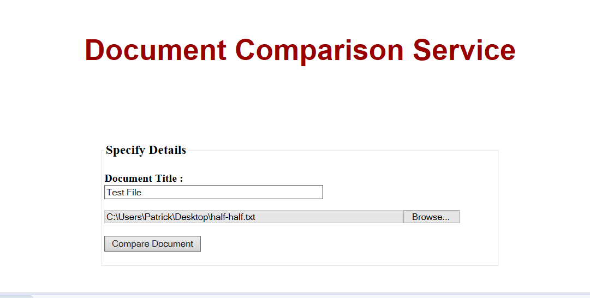
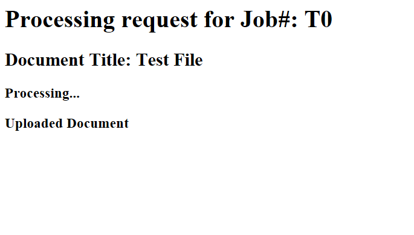
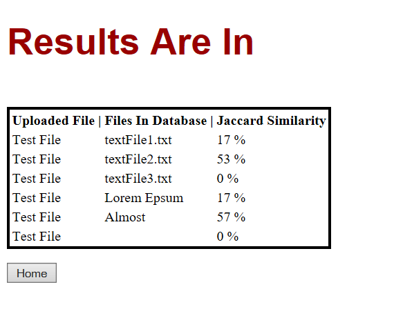

# A JEE Application for Measuring Document Similarity
> BSc (hons) in Software Development, Year 4  
> Module: Advanced Object Oriented Software Development  
> Lecturer: Dr John Healy  

## [Contents](#contents)   
* [Introduction](#intro)
* [Project Overview](#overview) 
* [Screen Shots](#screen) 
* [Technologies](#tech)
* [How To Run](#run)
 
# Introduction   
My name is [Patrick Moran](https://www.linkedin.com/in/patrick-moran-7a349014b/) and this is my 4th Year Advanced Object-Oriented Design Principles and Patterns Project.   

[Top](#contents) 

# Project Overview   
In this project we are required to develop a Java web application that enables two or more text documents to be compared for similarity. An overview of the project can be found below. 

     

#### Minimum Requirements
Your implementation should include the following features:
1. A document or URL should be specified or selected from a web browser and then
dispatched to a servlet instance running under Apache Tomcat.
2. Each submitted document should be parsed into its set of constituent shingles and
then compared against the existing document(s) in an object-oriented database (db4O)
and then stored in the database.
3. The similarity of the submitted document to the set of documents stored in the
database should be returned and presented to the session user.

[Top](#contents) 

# Screen Shots  
  
 
   

[Top](#contents) 

# Technologies   
### Java Servlet
 

A Java servlet is a Java program that extends the capabilities of a server. Java servelets most commonly implement applications hosted on web servers. Servlets are often used with the HTTP protocol. Servlets can be generated automatically from JavaServer Pages by the JavaServer Pages compiler. The difference between servlets and JSP is that servlets typically embed HTML inside Java code, while JSPs embed Java code in HTML. 

### JSP
 

JavaServer Pages (JSP) is a technology that helps developers create dynamically generated webpages using HTML, XML or other document types. In order to run a JSP page, a compatible web server is required. For example Apache Tomcat. 

### Apache Tomcat
 

Apache Tomcat is an open source Web Server and Java Servlet container, developed by the Apache Software Foundation. It provides a pure Java Web Server Envoirnment for Java code to run in. Tomcat Server is responsible for implementing the JavaServlet and the Java Server Pages specifications from [Sun Micro Systems](https://www.oracle.com/sun/index.html). More information can be found [here](https://tomcat.apache.org/whoweare.html).

### DB40
   

DB40 was an embedded, open source object database for Java and .net Developers. Support for DB40 stopped back in 2014 after it's developers, Actian, declined to actively pursue and promote the commercial db4o product to new customers. DB40 represents an object-oriented database model. One of its main goals is to provide an easy and native interface to persistence for object oriented programming languages. 

[Top](#contents) 

# How To Run
The following are instructions on how to run this application on your own machine:

Some Prerequisites:   
* Java SDK  
 If you don't have Java on your machine you can download it from [here](http://www.oracle.com/technetwork/java/javase/downloads/jdk8-downloads-2133151.html).

* Apache Tomcat Server  
For this project I'm using Apache Tomcat 8.5. You can download it [here](https://tomcat.apache.org/download-80.cgi).

* Eclipse IDE for Java EE Developers
You can download the eclipse IDE [here](https://www.eclipse.org/downloads/packages/eclipse-ide-java-ee-developers/keplersr2).

Step 1: Download or clone this repository.  
Step 2: Open Eclipse and Import the project named JEE-Application-for-Measuring-Document-Similarity.  
Step 3: Add Tomcat Server To the Project:  
> 3.1 Go to Window > Preferences > Server > Runtime Envoirnment  
> 3.2 Click add and select the version of tomcat you downloaded and click next.    
> 3.3 Browse to where you downloaded Apache Tomcat (Selecting the root directory) Click Finish.  
> 3.4 Then go to Project > Properties > Java Build Path > Libraries > Add Library > Server Runtime > Apache Tomcat and Finish.  

Step 4: To Initialise the database with three text files in the textFiles folder you need to set the absoulte path to that directory in the web.xml.  
> 4.1 Navigate to the textFiles folder in the project repository and copy the file path.  
> 4.2 Open the web.xml file (WebContent->WEB-INF) and replace the FILES_PATH paramater value with your file path.  

Step 5: Right Click on the project and select run as > Run On Server > Finish.  
Step 6: The browser in eclipse will open at the following URL: 
> http://localhost:8080/DocumentSimilarityProject/

Step 7: Submit a text File To Check Jaccard Index.

[Top](#contents) 